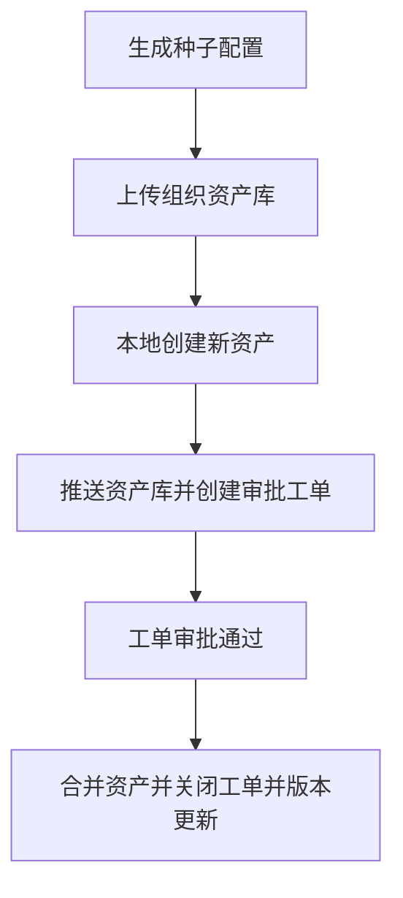
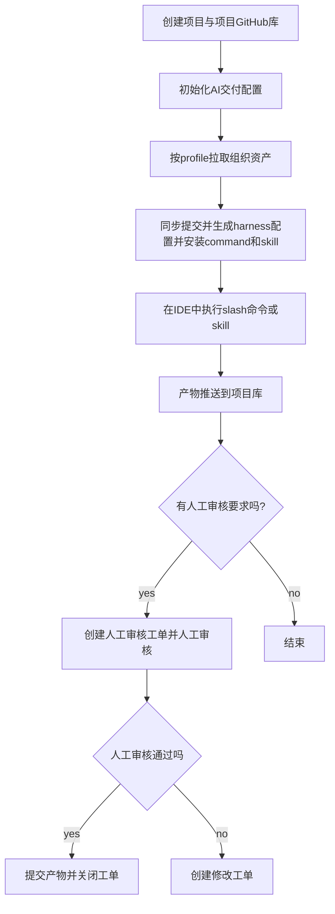

# 设计（可执行规格）

## 核心概念

| 概念 | 说明 |
| --- | --- |
| **Profile** | 交付方式：`lite` / `standard` / `strict` / `enterprise`。只声明启用哪些 stage/task，以及 task→suite 绑定。 |
| **Stage** | 交付阶段：`req` → `arch` → `dev` → `test`。 |
| **Task** | 阶段内执行单元。目录（id / title / required / 默认 sensor 建议）在代码 `STAGE_TASKS`；Profile 只做启用子集与 suite 覆盖。 |
| **Guide** | 前馈资产：skill、template、command、scaffold 等。注册时标注 `stage` + `task`。 |
| **Suite** | 命名的 sensor 包（反馈）。顶层 `suites` **只允许命名包**（如 `propose-sdlc`），禁止 `dev.propose` 这类 stage.task 字面 key。 |
| **Command** | 包装任务的外壳（slash / skill 同源）。IDE 名：`/hx-<stage>-<task>`。 |

真相源分工：

- **任务目录** → `packages/core/src/stages.ts`（`STAGE_TASKS`）
- **Profile 差异** → `harness.yaml` 的 `profiles.*.tasks`
- **Guide / Sensor 注册表** → `harness.yaml` 顶层数组

## Profile 配置形态

```yaml
profiles:
  enterprise:
    stages: [req, arch, dev, test]
    tasks:
      req:
        - id: requirements-analysis
          suite: req-analysis
        - id: biz-understanding          # 列出即启用；未列出则本 profile 不含
          suite: req-biz
      arch:
        - id: tech-selection
          suite: arch-tech
      dev:
        - id: propose
          suite: propose-sdlc
        - id: design
          suite: design-sdlc
      test:
        - id: test-case-design
          suite: test-design-sdlc
suites:
  req-analysis: [req-analysis-complete]
  propose-sdlc: [prd-complete, prd-approved, …]
```

兼容：旧字段 `req_tasks` / `arch_tasks` / `dev_tasks` / `test_tasks` + `suites: { "req.x": "name" }` 仍可解析；运行时经 `normalizeProfile` 归一为上表结构。

## 控制命令 / 技能格式

### 作者维护（正文）

```markdown
# /hx-<stage>-<task> — <short title>

## Input
- …

## Steps
1. …
2. …

## Output
- …

## Guardrails
- …

## Done when
- 一句：对应 CLI 绿灯（勿手抄 sensor 清单）
```

### 自动注入（adapter sync 附录）

| design1 字段 | 来源 |
| --- | --- |
| 特别上下文 | Context Pack 加载命令 + 本 task 绑定的 Skills / Templates |
| 特别约束 | Profile 绑定 suite 的 sensor 表 + `hx gate check --stage … --task …` |

厚写作方法下沉到 Skill / Template；command 只作薄检查清单。

可选 frontmatter 元数据（与 OpenSpec 风格兼容）：

```yaml
name: hx-arch-tech-selection
description: Fill technology selection in HLD overview
metadata:
  version: "1.0"
```

## 核心流程

### 资产维护过程



### 项目交付过程


