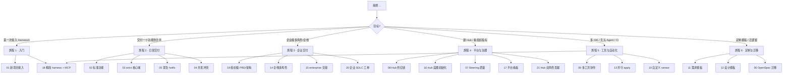

# 场景选择指南：按你的角色与目标选路径

**English**: [Scenario picker (English)](en/00-scenario-picker.md)

本文档帮助你在 22 个端到端场景中**快速选对入口**，避免按版本号或编号顺序硬啃。

## 第一步：你此刻最想完成什么？

## 按角色推荐

| 你是谁 | 建议路径 | 核心场景 |
| --- | --- | --- |
| 新项目技术负责人 | 旅程 1 → 2 | [01](01-新项目接入.md) → [02](02-标准功能开发全流程.md) |
| 日常功能开发（Cursor） | 旅程 2 | [02](02-标准功能开发全流程.md) |
| 支付/账务等核心域开发 | 旅程 2 | [03](03-核心域改动-strict-测试先行.md) |
| On-call / 紧急修复 | 旅程 2 | [05](05-紧急修复-lite.md) |
| 产品经理（组织级 PRD） | 旅程 3 | [产品经理需求文档编写使用手册](../pm-req-manual.zh-CN.md) · [19](19-组织级PRD与架构设计.md) |
| 架构师（组织级 HLD/LLD） | 旅程 3 | [架构师概要设计使用手册](../arch-hld-manual.zh-CN.md) · [19](19-组织级PRD与架构设计.md) |
| 企业 BA / 架构师（全流程） | 旅程 3 | [19](19-组织级PRD与架构设计.md) → [15](15-企业级需求到交付交接.md) |
| 全栈 TL（前后端多人） | 旅程 3 | [14](14-企业全栈多角色交付.md) |
| 企业流程 Owner（工单与变更联动） | 旅程 3 | [20](20-企业SDLC工单全流程.md) |
| 平台组 / 架构委员会 | 旅程 4 | [08](08-hub-资产共享与供应链.md) → [16](16-v0.3-hub-blueprint-init.md) → [17](17-v0.4-平台治理与仪表盘.md) |
| Hub 维护者 / 贡献者 | 旅程 4 | [21](21-hub-双角色与贡献审核.md) |
| 质量 / 效能负责人 | 旅程 4 | [07](07-steering-质量治理.md) |
| 工程效能（多 IDE + CI） | 旅程 5 | [09](09-多工具协作与CI强制.md) |
| 使用 Codex/脚本、无 Cursor UI | 旅程 5 | [18](18-精简配置与无头Agent-MCP.md) |
| 安全 / 合规扩展 | 旅程 5 | [10](10-自定义传感器与触发器.md) |
| 开工前定制产出格式 | 旅程 6 | [11](11-自定义需求产出模板.md) + [12](12-自定义概要设计产出模板.md) |
| 存量 OpenSpec 仓库 | 旅程 6 | [06](06-遗留项目迁移-openspec.md) |

## 六条使用者旅程（推荐顺序）

### 旅程 1：入门 — 从零到可交付

| 顺序 | 场景 | 产出 |
| --- | --- | --- |
| 1 | [01 新项目接入](01-新项目接入.md) | `harnessX/`、hooks、CI、adapter、宪法 |
| 2 | [02 标准功能全流程](02-标准功能开发全流程.md) | 第一个 change 走完 propose→archive |
| 可选 | [18 精简 harness + MCP](18-精简配置与无头Agent-MCP.md) | `imports:` 最小配置、无头 `hx apply` / MCP |

### 旅程 2：日常交付 — 不同风险档

| 场景 | 何时选 |
| --- | --- |
| [02 标准功能](02-标准功能开发全流程.md) | 常规需求，`standard` profile |
| [03 strict 核心域](03-核心域改动-strict-测试先行.md) | 支付/库存核心，测试先行 + 已批准断言 |
| [05 紧急 hotfix](05-紧急修复-lite.md) | 线上故障，`lite` 快通道 |
| [04 并发冲突](04-并发变更冲突.md) | 两团队同 capability，`rebase check` |

### 旅程 3：企业交付 — 多角色与全栈

| 场景 | 何时选 |
| --- | --- |
| [19 组织级 PRD/架构](19-组织级PRD与架构设计.md) | 先写 `docs/prd/`、`docs/architecture/`，再开 change |
| [14 全栈多角色](14-企业全栈多角色交付.md) | API + B 端 + C 端，五人分工 |
| [15 enterprise 交接](15-企业级需求到交付交接.md) | change 内需求分析 → HLD/LLD → `task-pack` 编码交接 |
| [20 企业 SDLC 工单](20-企业SDLC工单全流程.md) | 工单（WO/CR/Bug/Test）与 req/arch/change 一体化 |

### 旅程 4：平台与治理 — Hub 与组织视角

| 场景 | 何时选 |
| --- | --- |
| [08 Hub 供应链](08-hub-资产共享与供应链.md) | promote/review/add/sync/lock |
| [16 Hub 蓝图初始化](16-v0.3-hub-blueprint-init.md) | `init --from-hub`、`hub sync --apply` |
| [07 Steering 质量](07-steering-质量治理.md) | 失败沉淀为 Skill/Rubric |
| [17 平台看板](17-v0.4-平台治理与仪表盘.md) | prototype/UAT/drift、`hx view`、跨仓 coverage |
| [21 Hub 双角色贡献](21-hub-双角色与贡献审核.md) | consumer submit 与 maintainer 审核闭环 |

### 旅程 5：工具与自动化 — 不止 Cursor

| 场景 | 何时选 |
| --- | --- |
| [09 多工具协作](09-多工具协作与CI强制.md) | Cursor/Trae/Qoder/Claude 混用 |
| [13 并行编排](13-v0.2-编排与并行交付.md) | `--parallel`、`--fan-out`、`hx review` |
| [10 自定义 sensor](10-自定义传感器与触发器.md) | 安全扫描、file-save/schedule 触发 |
| [18 无头 MCP](18-精简配置与无头Agent-MCP.md) | Tier 2、`HX_TASK_*`、MCP `apply_task` |

### 旅程 6：定制与迁移

| 场景 | 何时选 |
| --- | --- |
| [11 需求模板](11-自定义需求产出模板.md) | 定制 proposal / delta spec |
| [12 设计模板](12-自定义概要设计产出模板.md) | 定制 design 结构与 `/hx-design` |
| [06 OpenSpec 迁移](06-遗留项目迁移-openspec.md) | 存量 `openspec/` 导入 |

## 能力 → 场景速查（最新版）

| 你想用的能力 | 去看 |
| --- | --- |
| `hx init --bundle` / `imports:` | 01、18 |
| `init --from-hub` / `blueprint.yaml` | 16 |
| `hub sync --apply` 三方合并 | 08、16 |
| `hx apply --runner` / `HX_TASK_PACK` | 02、15、18 |
| MCP `apply_task` / `fix_session` / `drift_check` | 18 |
| `prototype-complete` / `uat-complete` | 17 |
| `drift` sensor / `hx sync` | 06、17 |
| `steer coverage --aggregate` / `hx view` | 17 |
| `hub search` | 16、17 |
| Tier 2 补偿 | 01、09、18 |

## 阅读约定

与 [操作说明](../operation-guide.zh-CN.md) 一致：

- **`$ hx ...`**：在终端执行（管控面、批准、归档）。
- **`Cursor ▸`**：在 Cursor Agent 对话框执行（写规格、写代码、自校正）。
- 须先 `hx adapter sync`（场景 01）再使用斜杠命令。

完整索引见 [README](README.md)。
