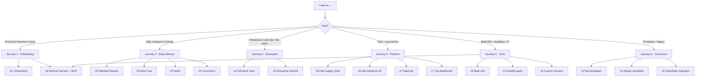

# Scenario Picker: Choose by Role and Goal

**中文**: [场景选择指南](../00-场景选择指南.md)

Use this guide to pick the right entry among **18 end-to-end scenarios** — not by version number or numeric order.

## Step 1: What do you need to accomplish?

## By role

| You are | Suggested path | Key scenarios |
| --- | --- | --- |
| New project tech lead | Journey 1 → 2 | [01](01-new-project-onboarding.md) → [02](02-standard-feature-development.md) |
| Feature developer (Cursor) | Journey 2 | [02](02-standard-feature-development.md) |
| Core-domain engineer (payments, etc.) | Journey 2 | [03](03-core-domain-strict-test-first.md) |
| On-call / incident response | Journey 2 | [05](05-emergency-hotfix-lite.md) |
| Enterprise BA / architect | Journey 3 | [15](15-enterprise-delivery-handoff.md) |
| Full-stack tech lead | Journey 3 | [14](14-enterprise-fullstack-multi-role.md) |
| Platform / architecture committee | Journey 4 | [08](08-hub-asset-sharing-supply-chain.md) → [16](16-v0.3-hub-blueprint-init.md) → [17](17-v0.4-platform-governance.md) |
| Quality / engineering effectiveness | Journey 4 | [07](07-steering-quality-governance.md) |
| Multi-IDE + CI owner | Journey 5 | [09](09-multi-tool-collaboration-ci-enforcement.md) |
| Headless agent (Codex, scripts) | Journey 5 | [18](18-minimal-harness-headless-mcp.md) |
| Security / compliance extension | Journey 5 | [10](10-custom-sensors-triggers.md) |
| Customize deliverable templates | Journey 6 | [11](11-custom-requirements-output-template.md) + [12](12-custom-design-output-template.md) |
| Legacy OpenSpec repo | Journey 6 | [06](06-legacy-migration-openspec.md) |

## Six user journeys

### Journey 1: Onboarding

| Step | Scenario | Outcome |
| --- | --- | --- |
| 1 | [01 New project](01-new-project-onboarding.md) | `harnessX/`, hooks, CI, adapter |
| 2 | [02 Standard feature](02-standard-feature-development.md) | First change propose→archive |
| Optional | [18 Minimal + MCP](18-minimal-harness-headless-mcp.md) | `imports:`, headless apply, MCP L1 |

### Journey 2: Daily delivery

| Scenario | When |
| --- | --- |
| [02 Standard](02-standard-feature-development.md) | Regular features, `standard` profile |
| [03 Strict core](03-core-domain-strict-test-first.md) | Core domain, test-first |
| [05 Hotfix](05-emergency-hotfix-lite.md) | Production incident, `lite` |
| [04 Concurrent](04-concurrent-change-conflicts.md) | Overlapping changes |

### Journey 3: Enterprise

| Scenario | When |
| --- | --- |
| [14 Full-stack roles](14-enterprise-fullstack-multi-role.md) | API + admin + portal |
| [15 Enterprise handoff](15-enterprise-delivery-handoff.md) | Requirements → HLD/LLD → task-pack |

### Journey 4: Platform & governance

| Scenario | When |
| --- | --- |
| [08 Hub supply chain](08-hub-asset-sharing-supply-chain.md) | promote/review/sync/lock |
| [16 Hub blueprint](16-v0.3-hub-blueprint-init.md) | `init --from-hub`, sync merge |
| [07 Steering](07-steering-quality-governance.md) | Failures → rules |
| [17 Dashboard](17-v0.4-platform-governance.md) | prototype/UAT/drift, `hx view` |

### Journey 5: Tools & automation

| Scenario | When |
| --- | --- |
| [09 Multi-tool](09-multi-tool-collaboration-ci-enforcement.md) | Cursor/Trae/Qoder/Claude |
| [13 Orchestration](13-v0.2-orchestration-parallel-delivery.md) | `--parallel`, `--fan-out`, review |
| [10 Custom sensors](10-custom-sensors-triggers.md) | Security scan, triggers |
| [18 Headless MCP](18-minimal-harness-headless-mcp.md) | Tier 2, `HX_TASK_*`, MCP |

### Journey 6: Customize & migrate

| Scenario | When |
| --- | --- |
| [11 Requirements template](11-custom-requirements-output-template.md) | Proposal / delta spec |
| [12 Design template](12-custom-design-output-template.md) | Design structure |
| [06 OpenSpec](06-legacy-migration-openspec.md) | Import existing OpenSpec |

## Capability → scenario

| Capability | Scenarios |
| --- | --- |
| `init --bundle` / `imports:` | 01, 18 |
| `init --from-hub` / blueprint | 16 |
| `hub sync --apply` | 08, 16 |
| `hx apply --runner` / `HX_TASK_PACK` | 02, 15, 18 |
| MCP `apply_task` / `fix_session` / `drift_check` | 18 |
| `prototype-complete` / `uat-complete` | 17 |
| `drift` / `hx sync` | 06, 17 |
| `steer coverage --aggregate` / `hx view` | 17 |
| `hub search` | 16, 17 |
| Tier 2 compensation | 01, 09, 18 |

Full index: [README](README.md).
