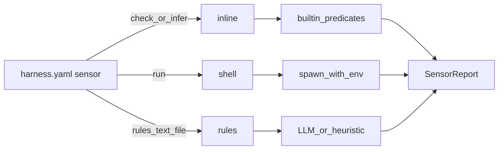

# Sensor 配置使用手册

面向技术经理 / 平台维护者：如何用 **三种检查形态**（`inline` / `shell` / `rules`）声明反馈检查（Sensor），而不改 TypeScript 引擎代码。

相关文档：

- CLI 字段速查：[cli-reference.zh-CN.md](cli-reference.zh-CN.md#sensor-可配置化)
- 自定义扫描器与触发器示例：[examples/en/10-custom-sensors-triggers.md](examples/en/10-custom-sensors-triggers.md) · [examples/10-自定义传感器与触发器.md](examples/10-自定义传感器与触发器.md)
- 企业交付与门禁：[enterprise-delivery.zh-CN.md](enterprise-delivery.zh-CN.md)

---

## 1. 概念：三种 `check`

| `check` | 含义 | 关键字段 |
| --- | --- | --- |
| **`inline`** | 内置谓词表达式（文件完整性、签核、EARS…） | `expr`，可选 `args` / `config` |
| **`shell`** | 外部命令（脚本 / npm / 扫描器） | `run`，可选 `output`、`timeout_ms` |
| **`rules`** | 规则文本 + 大模型/启发式评判 | `rules_text` 或 `rules_file`，`input`，`budget_tokens` |

用户只需写配置，不必写引擎名。复杂 TS 检查用 `expr: "handler.<id>"` 调用已注册处理器。



**配置分层（后者覆盖前者，深度合并对象）：**

1. `assets/sensors/<id>/config.yaml`
2. `harness.yaml` → 该 sensor 的内联字段 / `config:`

路径均相对 **`harnessX/`**（Workspace `base`）。

---

## 2. 在 harness.yaml 中注册

```yaml
sensors:
  - id: prd-approved
    kind: sensor.script
    execution: computational
    check: inline
    expr: "approval.prd == true"
    source: assets/sensors/prd-approved
    on_fail: block
    stage: req
    task: prd-writing

  - id: typecheck
    kind: sensor.script
    execution: computational
    check: shell
    run: "npm run typecheck"
    source: assets/sensors/typecheck
    on_fail: block

  - id: ai-spec-review
    kind: sensor.rubric
    execution: inferential
    check: rules
    rules_file: assets/rubrics/team-review/rules.yaml
    input:
      - proposal.md
      - specs/**/spec.md
    on_fail: warn
    budget_tokens: 8000
```

### 字段说明（三种 + 通用）

| 字段 | 适用 | 含义 |
| --- | --- | --- |
| `id` | 全部 | Suite / Gate 引用名 |
| `kind` / `execution` | 全部 | `sensor.*`；`computational` / `inferential` |
| `check` | 推荐 | `inline` \| `shell` \| `rules`（可省略，由字段推断） |
| `expr` | inline | 谓词表达式，见 §3 |
| `run` | shell | Shell 命令；可用 `$CHANGE` / `$OUTPUT` 等，见 §4 |
| `output` | shell | 显式 `$OUTPUT` 路径模板 |
| `rules_text` / `rules_file` | rules | 评判准则（Markdown 或 rubric YAML） |
| `input` | rules | 检查对象 glob（相对 change 目录或仓库根） |
| `source` | 推荐 | 资产目录 |
| `config` | 全部 | 内联参数，合并进包配置 |
| `on_fail` | 全部 | `block` / `warn` / `retry` |
| `timeout_ms` | shell 等 | 默认 `120000` |
| `budget_tokens` | rules | 送入评判内容的截断预算 |
| `trigger` / `scope` | file-save | 如 `tests/fixtures/**` |

解析优先级：显式 `check` → 否则由 `expr` / `run` / `rules_*` 推断。

---

## 3. `inline` — 谓词表达式

```yaml
- id: prd-approved
  check: inline
  expr: "approval.prd == true"
  on_fail: block

- id: fixture-guard
  check: inline
  expr: "fixture.hash_ok == true"
  trigger: file-save
  scope: ["tests/fixtures/**"]

- id: prd-sections
  check: inline
  expr: "doc.sections_complete(path=@prd, require=[user-stories, acceptance])"
```

### 一期谓词表

| 形式 | 含义 |
| --- | --- |
| `approval.<gate> == true` | 签核：`prd` / `arch` / `arch-lld` |
| `fixture.hash_ok == true` | 夹具指纹完整 |
| `file.exists(path)` / `file.min_bytes(path, n)` | 产物存在性 |
| `doc.sections_complete(...)` | 文档章节完备（复杂参数也可用 `config` / `args`） |
| `spec.ears_ok == true` | OpenSpec delta + EARS（原 `spec-validate`） |
| `arch.layers_ok` / `drift.ok` / `mutation.ok` | 映射现有 analyze 类检查 |
| `rules.list_ok` | 声明式 `rules.yaml` 规则列表 |
| `handler.<id>` | 调用已注册的 TS 处理器（如 `handler.spec-trace`） |
| `&&` | 布尔与（一期仅 `&&` 与单谓词组合） |

**不**执行任意 JavaScript。未列出的检查用 `handler.<id>`、`shell`，或后续加谓词。

复杂参数示例（旁路 YAML）：

```yaml
check: inline
expr: "doc.sections_complete"
config:
  path: "@prd"
  args:
    require: [user-stories, acceptance]
```

---

## 4. `shell` — 外部脚本

```yaml
- id: secscan
  check: shell
  run: "bash assets/sensors/secscan/check.sh"
  output: "changes/$CHANGE"
  on_fail: block
  timeout_ms: 180000
```

### 协议

- cwd = 仓库根；超时 = `timeout_ms`
- exit 0 → pass；非 0 → fail；可选 stdout 首行 `{...}` 为 `SensorReport`
- 崩溃 / 超时 → error（fail-closed）

### 注入环境变量

| 变量 | 含义 |
| --- | --- |
| `$CHANGE` / `HX_CHANGE` | 当前 change id（命令串替换 + env） |
| `$ROOT` / `HX_ROOT` | 仓库根 |
| `$BASE` / `HX_BASE` | `harnessX/` |
| `$SENSOR_ID` / `HX_SENSOR_ID` | sensor id |
| `$OUTPUT` / `HX_OUTPUT` | 任务产出目录或主产物路径 |
| `$OUTPUT_FILE` / `HX_OUTPUT_FILE` | 可解析到单一主文件时设为该路径，否则空 |
| `$SCOPE` / `HX_SCOPE` | file-save 匹配文件（换行分隔） |
| `$PROFILE` / `HX_PROFILE` | 当前 profile |

命令串中 `$CHANGE` 等会做字面替换；其余以 **env** 为主，降低注入歧义。

### `$OUTPUT` 解析规则

1. 若 `output:` / `config.output` 显式给出路径模板 → 插值后使用（`{change}` `{slug}` `{root}` `{base}` / `$CHANGE`）
2. 否则按 `stage`+`task`：如 `req`+`prd-writing` → PRD 文件；`arch` → overview；有 change → `changes/<id>`；否则仓库根
3. 脚本把结果写 stdout（JSON）或仅用 exit code；**不要求**写回 `$OUTPUT`

也可把 `check.sh` 放在 `source` 目录下且不写 `run`，解析器会自动识别为 shell。

---

## 5. `rules` — 规则文本 + 大模型

```yaml
- id: ai-spec-review
  check: rules
  execution: inferential
  rules_text: |
    变更说明与 delta 必须可测试；禁止模糊词；API 变更须有对应 Scenario.
  # 或
  # rules_file: assets/sensors/ai-spec-review/rules.md
  input:
    - proposal.md
    - specs/**/spec.md
  on_fail: warn
  budget_tokens: 8000
```

**行为：**

1. 收集 `input` globs（相对 change 目录，其次仓库根）拼成「任务输出」上下文，按 `budget_tokens` 截断并脱敏
2. 以 `rules_text` / `rules_file` 为评判准则（`.yaml` 走 rubric 结构；`.md` / 纯文本为自由准则）
3. 调用评判通道：`HX_JUDGE_CMD`（stdin JSON → stdout JSON verdict）或内置启发式
4. 产出 `SensorReport` findings

复杂量表仍可挂 `assets/rubrics/*/rules.yaml` 作为 `rules_file`。

未设置 `HX_JUDGE_CMD` 时，启发式会检查常见模糊词 / 空内容等；生产推断型门禁建议配置本地 LLM 命令。

---

## 6. 资产包布局

```
harnessX/assets/sensors/<id>/
  asset.yaml      # Hub / 清单（可选）
  config.yaml     # check / expr / run / rules_* …
  rules.md        # rules 检查时自动识别
  rules.yaml      # rubric 或 rule-list
  check.sh        # shell 入口（自动识别）
```

脚手架源：`packages/scaffold/base/assets/sensors/`（`hx init` 拷到项目）。

---

## 7. 触发方式

| `trigger` | 何时跑 | 备注 |
| --- | --- | --- |
| `task`（默认） | Gate / suite | 与 Profile suite 绑定 |
| `file-save` | `hx watch` | 配合 `scope` glob |
| `schedule` | `hx schedule run` | CI cron 等 |

```yaml
- id: fixture-guard
  check: inline
  expr: "fixture.hash_ok == true"
  trigger: file-save
  scope: ["tests/fixtures/**"]
  on_fail: block
```

---

## 8. 典型写法对照

| 典型 id | 写法 |
| --- | --- |
| `prd-approved` / `fixture-guard` / `spec-validate` | `check: inline` + 谓词 `expr` |
| `spec-trace` / 交付完备类 | `check: inline` + `expr: "handler.<id>"` |
| `typecheck` / 自定义扫描 | `check: shell` + `run` |
| `ai-spec-review` | `check: rules` + `rules_file` / `rules_text` |

---

## 9. 校验与排错

| 命令 | 作用 |
| --- | --- |
| `hx harness lint --completeness` | 检查 source / rules / 执行入口 |
| `hx doctor` | 含 harness 完整性 |
| Gate `status: error` | 配置错误或引擎未注册（fail-closed） |

| 现象 | 处理 |
| --- | --- |
| `inline check requires "inline" engine` | 使用官方 `hx`（已注册 `sensorEngines`） |
| `handler "…" is not registered` | 确认 `expr` 中的 id 与 `builtinSensors` 注册名一致 |
| `unknown inline predicate` | 对照 §3 谓词表；复杂逻辑改 `handler.*` 或 `shell` |
| shell 超时 | 调大 `timeout_ms` |
| rules 无 findings 且无 LLM | 设置 `HX_JUDGE_CMD` 或补全 `rules.yaml` 的 `pattern` |

---

## 10. 最小完整示例

```yaml
# harness.yaml
sensors:
  - id: secscan
    kind: sensor.script
    execution: computational
    check: shell
    run: "bash assets/sensors/secscan/check.sh"
    output: "changes/$CHANGE"
    on_fail: block
    timeout_ms: 180000
    stage: dev
    task: verify

suites:
  verification:
    - spec-validate
    - secscan
```

```bash
# assets/sensors/secscan/check.sh
#!/usr/bin/env bash
# 可用: $HX_CHANGE $HX_ROOT $HX_OUTPUT $HX_SCOPE …
echo "{\"status\":\"pass\",\"summary\":\"ok\",\"findings\":[]}"
exit 0
```
