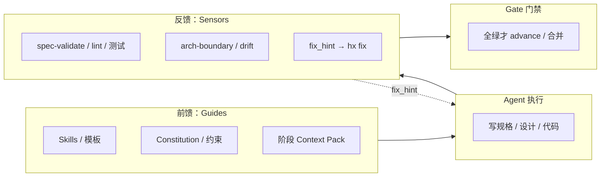
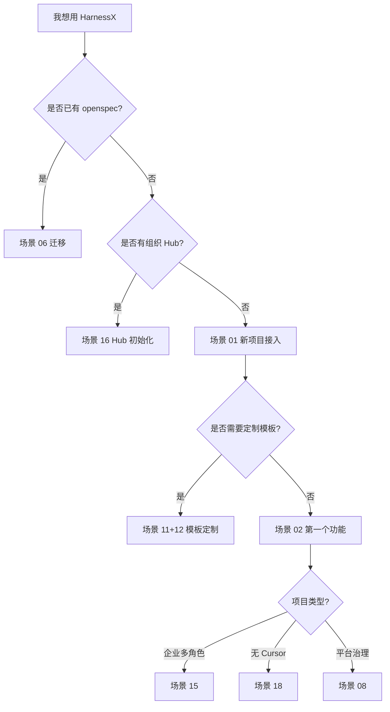

# HarnessX 使用说明

**English**: [Usage Guide (English)](usage-guide.en.md)

本文档按**主题**介绍 HarnessX 的用法，帮助你在不同角色与项目形态下快速上手并做个性化配置。与 [操作说明](operation-guide.zh-CN.md)（按交付阶段组织）和 [使用场景示例](examples/README.md)（18 个端到端旅程）互补：

| 文档 | 组织方式 | 适合何时读 |
| --- | --- | --- |
| **本文档** | 概念 → 初始化配置 → 特殊项目定制 | 第一次系统了解 HarnessX，或开工前做模板/规则配置 |
| [操作说明](operation-guide.zh-CN.md) | 需求 → 设计 → 编码 → 测试 | 日常查命令选项与配置文件字段 |
| [场景示例](examples/README.md) | 按使用者旅程 | 跟着完整故事走一遍 |
| [概念词表](glossary.zh-CN.md) | 术语速查 | 遇到名词不确定含义时 |

---

## 目录

1. [主题一：核心概念与典型使用场景](#主题一核心概念与典型使用场景)
2. [主题二：初始化前的个性化配置](#主题二初始化前的个性化配置)
3. [主题三：特殊项目的定制与使用](#主题三特殊项目的定制与使用)
4. [附录：速查表与延伸阅读](#附录速查表与延伸阅读)

---

## 主题一：核心概念与典型使用场景

### 1.1 HarnessX 是什么

HarnessX（`hx` CLI）是围绕 AI 编码 Agent 的**外 harness（控制平面）**，不是 Agent 本身，也不是单纯的测试框架或 CI 流水线。

它把 AI 软件交付当作**控制工程问题**来建模：



**一句话**：Guides 告诉 Agent **该怎么写**；Sensors 检验 **写得对不对**；Gates 决定 **能不能进入下一阶段**。

### 1.2 核心概念速览

| 概念 | 含义 | 在仓库中的位置 |
| --- | --- | --- |
| **Harness 实例** | 已初始化的项目工作区 | `harnessX/` |
| **Change** | 一次交付工作单元（功能、修复、迁移） | `harnessX/changes/<id>/` |
| **Profile** | 工作流档位（阶段序列 + 各阶段 sensor 套件） | `config.yaml` + `harness.yaml` |
| **Guide** | 前馈资产：Skill、模板、约束 | `harness.yaml` → `assets/guides/` |
| **Sensor** | 反馈检查：lint、测试、规格校验、架构扫描 | `harness.yaml` → `runs/` 报告 |
| **Gate** | 阶段推进条件；fail-closed（崩溃也阻断） | `meta.yaml` + `hx gate` |
| **Bundle** | 拓扑级 guides/sensors 打包（如 API 服务） | `imports:` 或 `assets/bundles/` |
| **Blueprint** | 交付路径预设（profile + Hub 依赖 + 阶段映射） | `blueprint.yaml` |
| **Hub** | 组织级资产注册表（packages / bundles / blueprints） | 独立 Git 仓或本地目录 |
| **Adapter** | 单源资产 → 多 IDE 目标编译 | `.cursor/`、`AGENTS.md` 等 |

资产解析优先级（同一 id 多处出现时）：

```text
change > local > team > hub > builtin
```

未声明的覆盖须在 `harness.yaml` 的 `overrides:` 中写明 `reason`。

概念详解见 [概念词表](glossary.zh-CN.md)。

### 1.3 三大 Harness 域

HarnessX 不只约束「代码质量」，还约束架构与行为：

| 域 | 约束什么 | 典型 Guide | 典型 Sensor |
| --- | --- | --- | --- |
| **Maintainability（可维护性）** | 风格、复杂度、类型安全 | coding-conventions Skill | lint、typecheck |
| **Architecture Fitness（架构适配）** | 模块边界、性能、可观测性 | performance-budget、layering 约束 | arch-boundary、budget |
| **Behaviour（行为正确性）** | 功能是否符合规格 | spec-writing、delta spec | spec-validate、spec-trace、E2E |

### 1.4 交付阶段与两种操作入口

标准 profile 的阶段序列：

```text
propose → design → spec → plan → apply → verify → archive
```

（`lite` 跳过 design/spec/plan/verify；`strict` / `enterprise` 增加 explore 或企业级检查，见 [1.6](#16-按风险选择-profile)）

| 入口 | 适用 | 示例 |
| --- | --- | --- |
| **终端 `$ hx ...`** | 管控面：批准、推进、豁免、归档、Hub/CI | `hx gate approve`、`hx archive` |
| **Cursor 对话框** | 执行面：写提案、规格、代码、自校正 | `/hx-propose`、`/hx-design`、`/hx-apply` |

经验法则：**Agent 能自己完成的走 Cursor；必须人工背书的走终端**（审计留痕）。

使用前须执行 `hx adapter sync`，将 `harnessX/assets/` 编译到 IDE 目录。

### 1.5 典型场景：从零到第一个 PR

**角色**：新项目技术负责人  
**目标**：30 分钟内让团队在同一套约束下用 Cursor 交付  
**详细 walkthrough**：[场景 01 新项目接入](examples/01-新项目接入.md)

```bash
# 1. 初始化（三选一，见主题二）
hx init --bundle api-service              # 单仓自包含
# 或 hx init 后 harness.yaml 写 imports: [api-service]  # 精简配置
# 或 hx init --from-hub api-service@1.0.0 --hub ./harness-hub  # 组织 Hub

# 2. 写宪法（核心域、不可妥协原则）
# 编辑 harnessX/constitution.md

# 3. 安装强制力
hx hooks install && hx ci init && hx adapter sync

# 4. 验证 Cursor：/hx 斜杠命令、规则拦截、fixture hook

# 5. 走第一个 change
hx change create my-feature --domains billing
# Cursor ▸ /hx-propose my-feature
hx gate approve my-feature --gate spec --approver alice
hx plan my-feature
hx apply my-feature --runner "<your-agent-cmd>"
hx verify my-feature && hx archive my-feature
```

**关键机制**：

- **Change 工作区**：行为改动在 `harnessX/changes/<id>/`，用 delta spec 描述增量；`archive` 才合并进主规格。
- **三层强制力**：IDE 规则（L1）→ git hooks（L2）→ CI 重放（L3）。三层都装，约束才是「硬」的。
- **单源编译**：改 `harnessX/assets/`，再 `hx adapter sync`；不要手改 `.cursor/` 下 GENERATED 文件。

### 1.6 典型场景：日常功能交付（standard）

**角色**：后端/全栈开发  
**目标**：常规需求从 propose 到 archive  
**详细 walkthrough**：[场景 02 标准功能全流程](examples/02-标准功能开发全流程.md)

核心循环：

```text
Cursor 写 proposal + delta spec
  → hx gate check --phase spec（spec-validate 自检）
  → Cursor /hx-design 写 design.md
  → hx gate advance（阶段推进）
  → hx gate approve --gate spec（人工批准 spec→plan）
  → hx plan（双轨 test + impl 任务）
  → hx apply --runner "<agent>"（带 HX_TASK_* 注入，失败 fix_hint 自校正）
  → hx verify → hx trace check → hx archive
```

Delta spec 使用 OpenSpec 格式（ADDED/MODIFIED/REMOVED + GIVEN/WHEN/THEN），由 `spec-validate` 机械校验——**格式错误在 propose 阶段就会被拦住**，不必等到 PR。

### 1.7 典型场景：按风险选择 profile

| Profile | 阶段 | 何时选 | 场景 |
| --- | --- | --- | --- |
| **lite** | propose → apply → archive | 紧急 hotfix、文案/配置小改 | [05 紧急修复](examples/05-紧急修复-lite.md) |
| **standard** | 完整七阶段（无 explore） | 大多数功能需求 | [02 标准功能](examples/02-标准功能开发全流程.md) |
| **strict** | + explore；verification-strict 套件 | 支付/库存等核心域，测试先行 | [03 核心域 strict](examples/03-核心域改动-strict-测试先行.md) |
| **enterprise** | + 需求分析/HLD/LLD/UAT 检查 | 多角色企业交付 | [14](examples/14-企业全栈多角色交付.md)、[15](examples/15-企业级需求到交付交接.md) |

在 `config.yaml` 设默认 profile；创建 change 时可用 `--profile` 覆盖：

```bash
hx change create hotfix-xxx --profile lite
hx change create payment-refund --profile strict --domains payments
```

`constitution.md` 中声明的 `core-domains` 会推荐团队对核心域使用 `strict`。

### 1.8 典型场景：平台与组织视角

| 目标 | 入口场景 |
| --- | --- |
| 中央 Hub 分发规范资产 | [08 Hub 供应链](examples/08-hub-资产共享与供应链.md) |
| 从 Hub 蓝图初始化新项目 | [16 Hub 蓝图初始化](examples/16-v0.3-hub-blueprint-init.md) |
| 失败沉淀为新 Skill/Rubric | [07 Steering 质量治理](examples/07-steering-质量治理.md) |
| 跨项目 coverage / 仪表盘 | [17 平台治理与仪表盘](examples/17-v0.4-平台治理与仪表盘.md) |

### 1.9 典型场景：多工具与无头 Agent

| 目标 | 入口场景 |
| --- | --- |
| Cursor + Trae + Claude 混用 | [09 多工具协作与 CI 强制](examples/09-多工具协作与CI强制.md) |
| Codex CLI / 脚本挂机 apply | [18 精简 harness + MCP](examples/18-精简配置与无头Agent-MCP.md) |
| 并行 apply / best-of-N | [13 编排与并行交付](examples/13-v0.2-编排与并行交付.md) |
| 自定义安全扫描等 Sensor | [10 自定义传感器与触发器](examples/10-自定义传感器与触发器.md) |

Tier 2 适配器（如 Codex、generic `AGENTS.md`）缺少 Cursor hooks 时，HarnessX 通过 **Gate 补偿**自动加强 L3 检查（追加 typecheck/lint，warn 升格为 block）。详见 [config.yaml 的 compensation](operation-guide.zh-CN.md#31-harnessxconfigyaml)。

### 1.10 心智模型（五条）

1. 行为改动在 **change 工作区**，用 delta spec 描述增量。
2. **Gate** 全绿 + 前置条件（如人工批准）才 `advance`；sensor 崩溃视为阻断（fail-closed）。
3. **Guide** 按阶段组装 Context Pack；**Sensor** 检验输出；失败带 `fix_hint`，可进 `hx fix` 回环。
4. `hx archive` 将 delta 合并进主规格，成为仓库真相。
5. 反复失败经 **Steering** 蒸馏为新 Guide，经 **Hub** 在组织内共享——harness 自身持续进化。

---

## 主题二：初始化前的个性化配置

> **最佳实践**：在团队写第一条 change **之前**完成本节配置。模板、Skill、Bundle、Hub 依赖一旦就位，后续每个 change 自动继承，无需重复解释格式。

### 2.1 选择初始化路径

| 路径 | 命令 | 适用 |
| --- | --- | --- |
| **A. 拓扑 Bundle** | `hx init --bundle <id>` | 单仓库自包含，不依赖组织 Hub |
| **B. 精简 imports** | `hx init` + `harness.yaml` 写 `imports: [<id>]` | 希望 harness 文件尽量短（v0.5+） |
| **C. 组织 Hub** | `hx init --from-hub <id>@<ver> --hub <path-or-git-url>` | 平台组维护中央资产 |
| **D. 企业蓝图** | `hx init --from-hub enterprise-delivery@1.0.0 --hub <hub>` | 多角色企业交付路径 |
| **E. 中文脚手架** | 以上任一路径 + `--locale hx-cn` | 中文宪法、命令提示词、fix_hint |

**内置拓扑 Bundle**（`hx bundle list`）：

| Bundle ID | 适用拓扑 |
| --- | --- |
| `api-service` / `api-service-cn` | 分层后端 API（routes → services → repositories） |
| `frontend-2c` | C 端 Web 应用 |
| `frontend-dashboard` | B 端管理后台 |
| `event-consumer` / `event-consumer-cn` | 事件消费者 |
| `library-sdk` | 可复用 SDK / 库 |
| `serverless-function` | Serverless 函数 |
| `mobile-app` | 移动应用 |
| `data-pipeline` | 数据管道 |

初始化后**必做三步**：

```bash
hx hooks install    # 本地 git hooks（apply 阶段快速门禁）
hx ci init          # GitHub Actions harness-verify 工作流
hx adapter sync     # 编译到 .cursor/ 等 IDE 目录
```

### 2.2 项目宪法 `constitution.md`

宪法是**最高优先级 Guide**（5–10 条不可妥协原则），Context Pack 始终包含它。

**应写什么**：

- 规格 vs 代码冲突时的处理原则
- 核心域列表（`core-domains:`，影响 strict 推荐）
- 团队不可违背的安全/合规/精度约束（如「金额必须用整数分」）

**不应写什么**：细则规范（放 Skill）、具体 API 设计（放 design/spec）

**配置步骤**：

1. 编辑 `harnessX/constitution.md`
2. 运行 `hx harness lint` 确认与 Bundle Skill 无矛盾

```markdown
## Core domains
core-domains: [coupon-issuing, coupon-redemption]

## Principles
6. 优惠券金额计算必须使用整数分（cent），任何浮点运算都是缺陷。
```

### 2.3 工作流选择 `config.yaml`

```yaml
profile: standard          # lite | standard | strict | enterprise
locale: zh-CN              # en | zh-CN

hub: ./harness-hub         # 可选：Hub 路径或 Git URL

adapter:
  target: cursor           # 主 IDE 目标

compensation:              # Tier 2 适配器时加强门禁
  enabled: true
  escalate_warn_to_block: true
```

| 字段 | 作用 |
| --- | --- |
| `profile` | 默认工作流档位 |
| `locale` | 脚手架与部分提示文案语言 |
| `hub` | 组织 Hub 来源，供 `hub add/sync/search` 使用 |
| `adapter.target` | 主 IDE，影响 notify 与文档 |
| `compensation` | 弱 IDE 时的 Gate 补偿策略 |

### 2.4 资产注册表 `harness.yaml`

`harness.yaml` 是 Guides、Sensors、Suites 的**中央注册表**，避免 Cursor Rules 散落导致指令冲突。

**精简写法（推荐，靠 imports 展开拓扑）**：

```yaml
version: "1.0"
constitution: constitution.md

imports:
  - api-service

profiles:
  standard:
    phases: [propose, design, spec, plan, apply, verify, archive]
    suites:
      spec: fast
      apply: fast
      verify: verification

guides: []
sensors: []
dependencies: []
overrides: []
```

**追加团队 Skill 的步骤**：

1. 创建 `harnessX/assets/guides/<id>/asset.yaml` + `SKILL.md`
2. 在 `harness.yaml` 的 `guides` 追加条目
3. `hx harness lint` → `hx lock write` → `hx adapter sync`

**覆盖 Hub/内置资产**（须写 reason）：

```yaml
overrides:
  - id: proposal-template
    source: assets/guides/proposal-template/template.md
    reason: "金融域合规：增加数据分类与合规影响字段"
```

### 2.5 交付蓝图 `blueprint.yaml`

Blueprint 描述「这类项目应走哪条交付路径」：继承 profile、声明 Hub 依赖、映射阶段 → guides/sensors。

```yaml
name: standard-delivery
extends: standard
hub_deps:
  - prd-writing@1.0.0
  - prototype-wireframe@1.0.0
phases:
  propose:
    guides: [prd-writing]
  design:
    guides: [prototype-wireframe]
  verify:
    sensors: [drift, uat-complete]
```

- 通过 `hx init --from-hub <blueprint>@<ver>` 应用
- 或在已有项目中编辑后走 Hub 蓝图安装流程（见 [场景 16](examples/16-v0.3-hub-blueprint-init.md)）

### 2.6 定制需求阶段产出模板

**适用**：合规要求固定 proposal 章节、统一 delta spec 命名  
**详细 walkthrough**：[场景 11 自定义需求产出模板](examples/11-自定义需求产出模板.md)

| 资产 | 类型 | 作用 |
| --- | --- | --- |
| `assets/guides/proposal-template/template.md` | `guide.template` | `hx propose` 渲染 proposal 脚手架 |
| `assets/guides/spec-writing/SKILL.md` | `guide.skill` | 约束 EARS 句式、需求命名 |
| `assets/guides/requirements-template/template.md` | `guide.template` | enterprise 需求分析产出（profile=enterprise） |

**可自定义**：proposal 额外章节、HTML 注释指引、`examples/` 金标准样例、Skill 中的命名约定

**不可去掉**（Gate 硬编码检查）：

- proposal 必须含 `## Why`、`## What Changes`、`## Impact`
- 不能残留 `{{title}}` 占位符
- delta spec 仍须通过 `spec-validate`（EARS + Scenario 结构）

**验证**：

```bash
hx harness lint && hx adapter sync
hx change create demo --domains billing
hx propose demo --title "演示"
# 检查 proposal.md 是否含定制章节
```

### 2.7 定制设计阶段产出模板

**适用**：团队要求 design.md 含接口清单、数据模型、可观测性、回滚策略等  
**详细 walkthrough**：[场景 12 自定义概要设计产出模板](examples/12-自定义概要设计产出模板.md)

1. 创建 `assets/guides/design-template/template.md` + `asset.yaml`
2. 在 `harness.yaml` 注册为 `guide.template`，`phase: [design]`
3. 可选定制 `assets/commands/design.md`（编译为 `/hx-design` 提示词）
4. `hx adapter sync` 后，Cursor `/hx-design` 会按模板扩写

> 当前版本：`design-template` 通过 Context Pack 注入；`hx design` 生成基础脚手架后由 agent 按模板扩写。后续版本可能支持像 proposal 一样直接渲染。

### 2.8 定制编码规范与架构约束

| 资产类型 | 路径示例 | 阶段 |
| --- | --- | --- |
| coding-conventions Skill | `assets/guides/coding-conventions/SKILL.md` | apply |
| 分层约束 | `assets/bundles/<bundle>/constraints/layering.yaml` | apply, verify |
| 性能预算 Skill | `assets/guides/.../performance-budget.md` | design, apply, verify |

Bundle 自带 constraint + sensor **成对出现**（如前馈 layering.yaml + 反馈 arch-boundary sensor）。

### 2.9 从 Hub 预装组织资产

组织级配置推荐在 **Hub 仓**维护，业务仓库通过 init/add/sync 消费：

```bash
# 平台组：种子 Hub
hx hub seed ./harness-hub

# 业务仓库：从 Hub 初始化
hx init --from-hub api-service@1.0.0 --hub ./harness-hub --adapter cursor

# 或初始化后追加包
hx hub add prd-writing@1.0.0 --hub ./harness-hub
hx lock write
```

本地定制与 Hub 升级冲突时，用 `hx hub sync --apply` 三方合并（见 [场景 08](examples/08-hub-资产共享与供应链.md)）。

### 2.10 初始化检查清单

在第一条 change 之前，确认：

- [ ] `constitution.md` 已写核心域与不可妥协原则
- [ ] `config.yaml` 的 profile / locale / hub 符合团队约定
- [ ] `harness.yaml` 已选 Bundle（`--bundle` 或 `imports:`）或 Hub 依赖
- [ ] 需求/设计模板已按需定制（场景 11、12）
- [ ] `hx harness lint` 通过
- [ ] `hx hooks install && hx ci init && hx adapter sync` 已执行
- [ ] `harness.lock` 已生成并提交（Hub/定制资产）
- [ ] Cursor `/hx` 斜杠命令与规则拦截已验证（场景 01 第 5 步）
- [ ] GitHub 分支保护已按 `BRANCH_PROTECTION.md` 配置

---

## 主题三：特殊项目的定制与使用

### 3.1 遗留项目：OpenSpec 迁移

**适用**：已有 `openspec/` 目录的存量仓库  
**详细 walkthrough**：[场景 06 遗留项目迁移](examples/06-遗留项目迁移-openspec.md)

```bash
hx openspec import --from openspec
# 映射 specs、进行中 change、project.md → constitution.md

hx sync                    # 发现 spec↔test 漂移
hx hooks install && hx ci init && hx adapter sync
```

| 漂移类型 | 处理 |
| --- | --- |
| 规格有、测试无 | 补测试或开 change 走 REMOVED delta |
| 测试有、规格无 | 开 change 走 ADDED delta 回写现状 |
| 纯遗留代码 | 「改哪补哪」渐进覆盖 |

短期并行：在 `config.yaml` 设 `compat_mode: openspec`，HarnessX 直接使用 `openspec/` 目录。

### 3.2 企业级多角色交付

**适用**：BA → 架构师 → 前后端多人协作  
**详细 walkthrough**：[场景 14](examples/14-企业全栈多角色交付.md)、[场景 15](examples/15-企业级需求到交付交接.md)

初始化：

```bash
hx init --from-hub enterprise-delivery@1.0.0 --hub ./harness-hub
```

企业 profile 额外产物：

- `requirements/` 需求分析制品
- `design/` HLD + LLD 包
- `delivery-trace.yaml` 交接追溯
- `@design=` 任务标注、`hx guide task-pack` 编码交接

额外 sensor：`requirements-complete`、`design-hld-complete`、`prototype-complete`、`uat-complete`、`design-drift` 等。

### 3.3 多拓扑 / 全栈 monorepo

一个仓库含 API + B 端 + C 端时：

```yaml
imports:
  - api-service
  - frontend-dashboard
  - frontend-2c
```

或在 `hx bundle add` 后合并多个 Bundle 的 guides/sensors。并行 apply 时用 `tasks.md` 中的 `@group` 标注：

```bash
hx apply my-change --parallel 2 --runner "<agent>"
```

### 3.4 核心域与 strict / 测试先行

**适用**：支付、账务、库存等高风险域  
**详细 walkthrough**：[场景 03](examples/03-核心域改动-strict-测试先行.md)

1. `constitution.md` 声明 `core-domains`
2. change 使用 `--profile strict`
3. `hx testfirst generate` → 人工 `hx testfirst approve` 批准测试基线
4. `hx apply` 实现代码；已批准 fixture 哈希锁定，agent 不可篡改

### 3.5 紧急修复 lite 通道

**适用**：线上故障、小范围 hotfix  
**详细 walkthrough**：[场景 05](examples/05-紧急修复-lite.md)

```bash
hx change create hotfix-xxx --profile lite
# propose → apply（跳过 design/spec/plan/verify 大部分检查）
hx archive hotfix-xxx --force   # 谨慎：跳过 verified 要求
```

事后应开 standard change 补规格与测试。

### 3.6 自定义 Sensor 与触发器

**适用**：安全扫描、合规检查、保存即扫  
**详细 walkthrough**：[场景 10](examples/10-自定义传感器与触发器.md)

```yaml
sensors:
  - id: secscan
    kind: sensor.script
    execution: computational
    phase: [verify]
    trigger: phase              # phase | file-save | schedule
    plugin: "cmd:python3 harnessX/plugins/secscan_adapter.py"
    on_fail: block
    fix_hint: "修复扫描报告后重跑 hx gate check"
    timeout_ms: 180000
```

插件协议：stdin JSON 上下文 → stdout JSON 报告（含 `findings[].fix_hint`）。

触发器 `file-save` 可在编辑高危路径时即时扫描，不等到 verify 阶段。

### 3.7 无 Cursor UI：精简 harness + MCP

**适用**：Codex CLI、OpenCode、自研脚本  
**详细 walkthrough**：[场景 18](examples/18-精简配置与无头Agent-MCP.md)

```yaml
# harness.yaml 仅保留 imports
imports:
  - api-service
```

```bash
hx adapter sync --targets codex,generic
hx apply my-change --runner 'codex exec --prompt "$HX_TASK_TITLE"'
hx mcp   # 暴露 apply_task、fix_session、drift_check
```

L1 标准契约环境变量（见 `schemas/l1/agent-env-contract.json`）：

- Apply：`HX_TASK_ID`、`HX_TASK_PACK`、`HX_FIX_HINTS`
- Fix：`HX_FIX_PACK`、`HX_FIX_SENSOR`

### 3.8 并发变更与冲突

**适用**：多团队同时改同一 capability  
**详细 walkthrough**：[场景 04](examples/04-并发变更冲突.md)

- 创建 change 时用 `--domains` 声明触及域
- 归档前 `hx rebase check <change>` 预检 delta 冲突
- 规格目录设 CODEOWNERS，规格改动必须 review

### 3.9 组织 Hub：资产全生命周期

**适用**：平台组维护中央规范、多仓库消费  
**详细 walkthrough**：[场景 08](examples/08-hub-资产共享与供应链.md)

```text
本地验证 → hx steer publish / hx hub promote
         → hx hub review request/approve
         → hx hub asset promote --to enforced
         → 业务仓 hx hub add + hx lock write
         → 升级时 hx hub sync --apply
```

Hub 包须过注入扫描；`harness.lock` 防供应链篡改。

### 3.10 Steering：从失败到规则

**适用**：同一类 agent 错误反复出现  
**详细 walkthrough**：[场景 07](examples/07-steering-质量治理.md)

```bash
hx steer report <change>           # 失败报告
hx steer distill                     # 生成 Harness Patch 提案
hx steer publish <asset-dir> --hub ./harness-hub --by alice
```

Steering 改进的是 **harness 本身**（新 Skill、Rubric、模板），而不只是单次代码修复。

### 3.11 自建 Bundle / Blueprint（平台组）

为特殊拓扑创建组织级 Bundle：

```text
harness-hub/
├── packages/<skill-id>/<version>/     # 可复用 Skill、模板
├── bundles/<topology-id>/<version>/   # bundle.yaml + assets
├── blueprints/<name>/<version>/       # blueprint.yaml + hub_deps
└── evals/golden-repos/                # hub eval 验收集
```

`bundle.yaml` 结构参考内置 `packages/bundles/api-service/bundle.yaml`：

- `guides[]`：Skill、constraint、template
- `sensors[]`：builtin 或 plugin
- `suites`：verification 等套件扩展

业务仓库通过 `hx init --from-hub <bundle>@<ver>` 或 `imports: [<id>]` 消费。

### 3.12 特殊项目选型速查

| 项目特征 | 推荐配置 | 场景 |
| --- | --- | --- |
| 全新后端 API | `--bundle api-service` 或 Hub 等价物 | 01 |
| 全新 C 端 / B 端 | `frontend-2c` / `frontend-dashboard` | 01 |
| 存量 OpenSpec | `hx openspec import` | 06 |
| 金融/支付核心域 | `profile: strict` + testfirst | 03 |
| 企业 BA+架构+研发 | `enterprise-delivery` 蓝图 | 14, 15 |
| 14+ 仓库统一规范 | 中央 Hub + lock | 08, 16 |
| 无 Cursor、纯 CLI | imports + MCP + Tier 补偿 | 18 |
| 安全合规扩展 | 自定义 sensor + file-save 触发 | 10 |
| 紧急 hotfix | `profile: lite` | 05 |
| 定制 proposal/design 格式 | 改 template + overrides | 11, 12 |

---

## 附录：速查表与延伸阅读

### A. 常用命令

| 类别 | 命令 |
| --- | --- |
| 初始化 | `hx init`、`hx bundle list/add`、`hx hooks install`、`hx ci init`、`hx adapter sync` |
| Change 生命周期 | `hx change create/list`、`hx propose/design/plan/apply/verify/archive` |
| Gate | `hx gate check/advance/approve/replay` |
| 质量 | `hx trace check`、`hx sync`、`hx fixture approve/verify`、`hx testfirst` |
| Hub | `hx hub seed/add/sync/promote/search/eval/review/policy` |
| 治理 | `hx steer report/distill/publish/coverage`、`hx view`、`hx lock write/verify` |
| 无头 | `hx apply --runner`、`hx mcp`、`hx fix` |

完整选项见 [操作说明](operation-guide.zh-CN.md)。

### B. Profile 阶段与套件对照

| Profile | 阶段 | verify 套件（示意） |
| --- | --- | --- |
| lite | propose, apply, archive | （apply 阶段 fast-lite） |
| standard | 七阶段 | spec-validate, spec-trace, drift |
| strict | + explore | + mutation-probe, ai-spec-review |
| enterprise | + explore | + design-drift, uat-complete, prototype-complete 等 |

### C. 文档索引

| 文档 | 说明 |
| --- | --- |
| [操作说明](operation-guide.zh-CN.md) | 按阶段查命令与配置字段 |
| [场景选择指南](examples/00-场景选择指南.md) | 18 个场景快速选型 |
| [概念词表](glossary.zh-CN.md) | 术语定义 |
| [系统设计](harness-delivery-system-design.html) | 完整设计文档 |
| [包边界](architecture/package-boundaries.md) | 扩展点与模块边界 |
| [L1 契约 Schema](../schemas/l1/agent-env-contract.json) | Agent 环境变量 |
| [README](../README.md) | 项目概览与 Quick start |

### D. 不确定从哪开始？



---

*文档版本与 HarnessX 仓库同步。命令行为以 `hx <cmd> --help` 与源码为准。*
